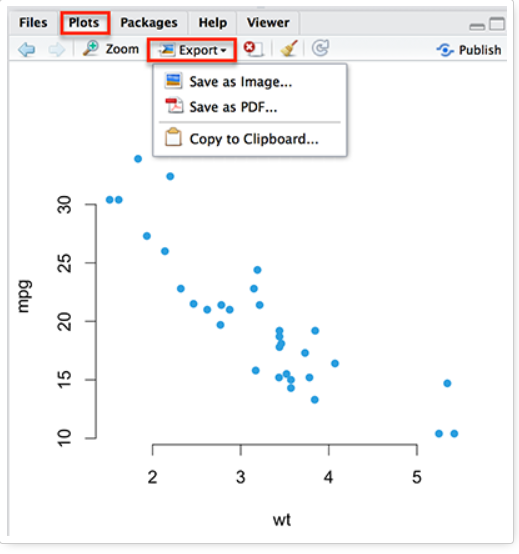
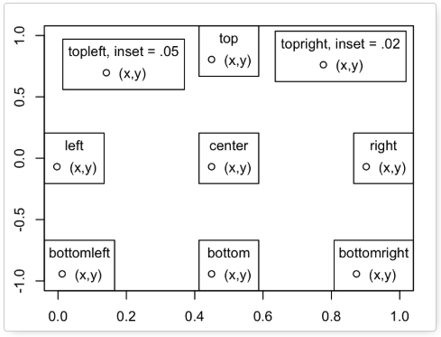

**Note:**

-An R Notebook is an R Markdown document with chunks that can be executed independently and interactively, with output visible immediately beneath the input.

-Notebook output are available as HTML, PDF, Word, or Latex. 

-This Notebook as HTML is preferably open with Google Chrome.

-R-Code can be extracted as Rmd file under the button "Code" in the notebook.

-This Notebook using iterative development. It means the process starts with a simple implementation of a small set of idea requirements and iteratively enhances the evolving versions until the complete version is implemented and perfect.


____________


```{r}

#quelle:https://www.waltersandwalters.co.uk/WSC-CSC-School-Black-and-Chalk-Board-Chalk-Sticks

```


<br>

#Introduction and welcome 

**Why R?:**

* Free and open source

* Built for statistical computing

* Visualization tools

* Tools for building Models


**Learning Objectives:**

* How to create beautiful, useful, and insightful graphics and charts

* How to customize the look of them


>All languages have their inconsistencies include R Programming. This documentation helps us to create visualizing in default R graphics before to far away using the packages.

<br>

#1-Creating and Saving Graphs in R

**Creating graphs:**

Used `mtcars` dataset for this section:
```{r}
?mtcars
head(mtcars,5)
```


Created a graphs with `plot()` function:
```{r}
plot(x = mtcars$wt, y = mtcars$mpg,
     pch = 16, frame = FALSE,
     xlab = "Weight (1000 lbs)", ylab = "Miles/(US) gallon", col = "#2E9FDF")
```

**Saving graphs:**

There are two ways of saving graphs in R

1. In RStudio IDE: 

Plots panel -> Export -> Save as Image or Save as PDF


```{r}

#preference:http://www.sthda.com/english/wiki/r-base-graphs

```


2. Using R codes:

  * Choose the format
  
  * Create the graphs
  
  * Enter the dev.off() command
  
Example-> 

**Note:** The file you save are in the current working directory. 

The command to get directory is `getwd()`

```{r}

# 1. Choose the format
png("rplot.jpg") #width = 25, height = "25"

# 2. Create the graphs
plot(x = mtcars$wt, y = mtcars$mpg,
     pch = 16, frame = FALSE,
     xlab = "wt", ylab = "mpg", col = "#2E9FDF")

# 3. Save the file with dev.off() command in directory
dev.off()

```

File formats for exporting plots are:

 * pdf("rplot.pdf"): pdf file
 
 * png("rplot.png"): png file
 
 * jpeg("rplot.jpg"): jpeg file
 
 * postscript("rplot.ps"): postscript file
 
 * bmp("rplot.bmp"): bmp file
 
 * win.metafile("rplot.wmf"): windows metafile
 
<Br>

#2-Standard graphical formatting

##2.1 Introduction `plot()` function

`plot()` function is generic function for plotting of R objects in basic graphs.

* `plot()` : the main function.

* `par()`  : the default settings (rows x columns) for plots.

* There are many other plot functions which are specific to some tasks such as `hist()`, `boxplot()`, etc. Most of them take the same arguments as the `plot()` function.

Formula: 

>plot(x, y, type="p")

* **x** and **y**: the coordinates of points to plot

* `type`:
      * "p" for points,

      * "l" for lines,

      * "b" for both,

      * "c" for the lines part alone of "b",

      * "o" for both 'overplotted',

      * "h" for 'histogram' like (or 'high-density') vertical lines,

      * "s" for stair steps,

      * "S" for other steps, see 'Details' below,

      * "n" for no plotting.


Example:
```{r}

par(mfrow=c(3,3), mar=c(3,3,1,0)+.5, mgp=c(1.6,.6,0))  # set up the graphics
x<-1:5; y=x*x
plot(x, y, type="p",col="blue")
plot(x, y, type="l",col="bisque")
plot(x,y, type="b",col="green")
plot(x, y, type="c",col="red")
plot(x, y, type="o",col="pink")
plot(x,y, type="h",col="orange")
plot(x, y, type="s",col="purple")
plot(x, y, type="S",col="black")
plot(x,y, type="h",col="blue")

#for more color type used the sintaks color()
```


More info about `plot()` go to RDocumentation [here](https://www.rdocumentation.org/packages/graphics/versions/3.5.1/topics/plot)


##2.2 Titles

* `main="test"`: main titles

* `sub="text"`: subtitle

* `xlab="test"`: the name of the x axis

* `ylab="test"`: the name of the y axis.

**Main title and axis labels:**

```{r}

x<-1:5; y=x*x
plot(x, y, type="p",col="blue",main="Exponential",sub="Example",ylab="Y Axis",xlab="X Axis")

```

**Title colors:**

```{r}

x<-1:5; y=x*x
plot(x, y, type="p",col="blue",main="Exponential",sub="Example",ylab="Y Axis",xlab="X Axis",
     col.main="#EC0033", col.lab="#00AB6F", col.sub="#CD0074")

```

**The font style:**

The possible values for the font style are :

1: normal text

2: bold

3: italic

4: bold and italic

5 : Symbol font

```{r}

x<-1:5; y=x*x
plot(x, y, type="p",col="blue",main="Exponential",sub="Example",ylab="Y Axis",xlab="X Axis",
     col.main="red", col.lab="blue", col.sub="green",
     font.main=3, font.lab=4, font.sub=4
     )

```

**The font size:**
```{r}

x<-1:5; y=x*x
plot(x, y, type="p",col="blue",main="Exponential",sub="Example",ylab="Y Axis",xlab="X Axis",
     col.main="red", col.lab="blue", col.sub="green",
     font.main=3, font.lab=4, font.sub=4,
     cex.main=4, cex.lab=1.5, cex.sub=1.2
     )

```


**Use the title() function:**

```{r}

x<-1:5; y=x*x
plot(x, y, type="p")
title(main = "Main title", sub = "Sub-title",
      xlab = "X", ylab = "Y",
      cex.main = 2,   font.main= 4, col.main= "red",
      cex.sub = 0.75, font.sub = 2, col.sub = "green",
      col.lab ="darkblue"
      )

```

**Customize the titles using par() function:**

```{r}

par(
  # Change the colors
  col.main="red", col.lab="blue", col.sub="black",
  # Titles in italic and bold
  font.main=4, font.lab=4, font.sub=4,
  # Change font size
  cex.main=2, cex.lab=1.7, cex.sub=1.2
  )
plot(x, y, type="p",
     main="TMain title",
        xlab="X axis",
        ylab="Y axis",
        sub="Sub title"
     )

```


##2.2 Legend

* `legend()`: the position can be "bottomleft", "bottomright", "topleft", "topright" or exact coordinates.

**R legend function:**


Formula:

>legend(x, y=NULL, legend, fill, col, bg)

Example:
```{r}

# Generate example data
x<-1:5; y1=x*x; y2=3*y1
plot(x, y1, type="b", pch=19, col="#FFD900", xlab="x", ylab="y")
# Add a line
lines(x, y2, pch=18, col="#8C6DD7", type="b", lty=2)
# Add a legend
legend(1, 20, legend=c("Line 1", "Line 2"),
       col=c("#FFD900", "#8C6DD7"), lty=1:2, cex=0.8)

```

Create R function to avoid repeating graphs code:
```{r}

# Generate example data
make_plot<-function(){
x<-1:5; y1=x*x; y2=3*y1
plot(x, y1, type="b", pch=19, col="red", xlab="x", ylab="y")
# Add a line
lines(x, y2, pch=18, col="blue", type="b", lty=2)
# Add a legend
legend(1, 20, legend=c("Line 1", "Line 2"),
       col=c("red", "blue"), lty=1:2, cex=0.8)
}

```


**Title, text font and background color of the legend box:**

* title: The title of the legend
* text.font: an integer specifying the font style of the legend text; possible values are :
    * 1: normal
    * 2: bold
    * 3: italic
    * 4: bold and italic
    * bg: background color of the legend box

```{r}

make_plot()

# Add a legend to the plot
legend(1,20, legend=c("Line 1", "Line 2"),
       col=c("red", "blue"), lty=1:2, cex=0.8,
       title="Line types", text.font=4, bg="lightblue")


```


**Border of the legend box:**

* box.lty: modify the line type

* box.lwd: modify the width

* box.col: modify the color
```{r}

par(mfrow=c(2,1), mar=c(3,3,1,0)+.5, mgp=c(1.6,.6,0))  # set up the graphics
# Remove legend border using box.lty = 0
make_plot()
legend(1,20, legend=c("Line 1", "Line 2"),
       col=c("red", "blue"), lty=1:2, cex=0.8,
       box.lty=0)
# Change the border
make_plot()
legend(1,20, legend=c("Line 1", "Line 2"),
       col=c("red", "blue"), lty=1:2, cex=0.8,
       box.lty=2, box.lwd=2, box.col="green")

```

**The legend position by keywords:**

Using the following keywords : "bottomright", "bottom", "bottomleft", "left", "topleft", "top", "topright", "right" and "center".


```{r}

par(mfrow=c(2,1), mar=c(3,3,1,0)+.5, mgp=c(1.6,.6,0))  # set up the graphics
# Remove legend border using box.lty = 0
make_plot()
legend("center", legend=c("Line 1", "Line 2"),
       col=c("red", "blue"),box.lty=0)
make_plot()
legend("topright", legend=c("Line 1", "Line 2"),
       col=c("red", "blue"),
       box.lty=0)

```

##2.3 Text

`text()` and `mtext()` R functions can be used To add a text to a plot.


**Texts within the graph:**

Formula:

>text(x, y, labels)

Example:
```{r}

d<-head(mtcars)
plot(d[,'wt'], d[,'mpg'], 
     main="Milage vs. Car Weight\n~~~~~~~~~~~~~~~~~~~",
      xlab="Weight", ylab="Miles/(US) gallon",
      pch=19, col="darkgreen")
text(d[,'wt'], d[,'mpg'],  row.names(d),
     cex=0.85, pos=2,col="red")

```

**Text in the margins of the graph:**

* text : the text to be written
* side : an integer specifying the side of the plot; Possible values are :
   * 1: bottom
   * 2: left
   * 3: top
   * 4: right
 
```{r}

plot(1:7, 1:7, 
     main="mtext(...) examples",col="blue")
mtext("Magic function", side=4)

```
 
**Mathematical annotation within the graph:**

Example:
```{r}

plot(1:7, 1:7, 
     main="text(...) examples",col="black")
text(2, 4, expression(hat(beta) == (X^t * X)^{-1} * X^t * y))
text(2, 6, expression(bar(x) == sum(frac(x[i], n), i==1, n)))

```

##2.4 Types

An option for plot types can be:

`type`:
      * "p" for points,

      * "l" for lines,

      * "b" for both,

      * "c" for the lines part alone of "b",

      * "o" for both 'overplotted',

      * "h" for 'histogram' like (or 'high-density') vertical lines,

      * "s" for stair steps,

      * "S" for other steps, see 'Details' below,

      * "n" for no plotting.
      
      
```{r}

x <- rnorm(100) 
par(mfrow = c(2,2))
plot(x, type = "p", main = "points", ylab = "", xlab = "",col="red")
plot(x, type = "o", main = "overplotted", ylab = "", xlab = "",col="green")
plot(x, type = "h", main = "histogram", ylab = "", xlab = "",col="blue")
plot(x, type = "S", main = "steps", ylab = "", xlab = "",col="orange")

```

##2.5 Axis

**Add an axis to a plot:**

Formula:

>axis(side, at=NULL, labels=TRUE)


side :  

* 1: below

* 2: left

* 3: above

* 4: right

* at: The position

* labels: Texts for tick-mark labels.

Example :

```{r}

par(mfrow=c(3,1), mar=c(3,3,1,0)+.5, mgp=c(1.6,.6,0))  # set up the graphics
x<-1:3; y=x*x
# Example 1
plot(x, y, axes = FALSE)
axis(side=1, at = 1:3, labels=LETTERS[1:3])
axis(2)
# Example 2
plot(x, y, axes = FALSE)
axis(side=1, at=1:3, labels=LETTERS[1:3])
axis(2)
box() #- To make it look like "usual" plot
#Example3:
plot(x, y, pch=18, col="red", type="b",
     frame=FALSE, xaxt="n") # Remove x axis
axis(1, 1:4, LETTERS[1:4], col.axis="blue")
axis(3, col = "darkgreen", lty = 2, lwd = 0.5)
axis(4, col = "violet", col.axis = "dark violet", lwd = 2)

```


**Axis scale:**

* xlim: the limit of x axis; format : xlim = c(min, max)

* ylim: the limit of y axis; format: ylim = c(min, max)

Transformation to log scale:

* log = "x"

* log = "y"

* log = "xy"*

Example:

```{r}

par(mfrow=c(3,1), mar=c(3,3,1,0)+.5, mgp=c(1.6,.6,0))  # set up the graphics
x<-1:20; y=x*x
# Simple graph
plot(x, y,col="#FF5300")
# Enlarge the scale
plot(x, y, xlim=c(1,15), ylim=c(1,150),col="#FF5300")
# Log scale
plot(x, y, log="y",col="#FF5300")

```

**Axes fonts:**

Remove them with `axes=FALSE`.

```{r}

par(mfrow=c(2,1), mar=c(3,3,1,0)+.5, mgp=c(1.6,.6,0))  # set up the graphics
x1<-1:10
x2<-11:20
plot(x1,x2,axes=FALSE)
plot(x1,x2,axes=FALSE)
axis(1,col="red",col.axis="blue",font.axis=3)
axis(2,col="red",col.axis="blue",font.axis=2,las=2)

```


**Axes positions:**

Use `las` function to specified the style of axis labels. 

* 0 : always parallel to the axis [default]

* 1 : always horizontal

* 2 : always perpendicular to the axis

* 3 : always vertical


```{r}

x1 <- rnorm(150)
par(mfrow = c(2,2))
plot(x1, las = 0, main = "las = 0", sub = "always parallel to the axis", xlab = "", ylab = "",col="blue")
plot(x1, las = 1, main = "las = 1", sub = "always horizontal", xlab = "", ylab = "",col="blue") 
plot(x1, las = 2, main = "las = 2", sub = "always perpendicular to the axis", xlab = "", ylab = "",col="blue")
plot(x1, las = 3, main = "las = 3", sub = "always vertical", xlab = "", ylab = "",col="blue")

```


##2.6 Margins par()

Formula:

>par(mfrow=c(2,1), mar=c(3,3,1,0)+.5, mgp=c(1.6,.6,0))  # set up the graphics

See `?par` to learn more about the topic.


##2.7 Colors

Use by name (e.g col = "red") or as a hexadecimal RGB triplet (such as col = "#FFCC00").


**Default color in R:**
```{r}

colors() # list the r colors

```


More info about color-> 

* [Colors in R](https://github.com/itsmecevi/Colors-in-R/blob/master/Rcolor.pdf)

* [R color cheatsheet](https://github.com/itsmecevi/R-color-cheatsheet/blob/master/colorPaletteCheatsheet.pdf)


##2.8 Points

Using `pch=""`. It has values between 1 till 25 or a single character.

```{r}

par(mfrow=c(4,2), mar=c(3,3,1,0)+.5, mgp=c(1.6,.6,0))  # set up the graphics
x1<-rnorm(10)
plot(x1, type = "p", pch = 0)
plot(x1, type = "p", pch = 10)
plot(x1, type = "p", pch = 25)
plot(x1, type = "p", pch = "a")
plot(x1, type = "p", pch = "*")
plot(x1[1:26], type = "p", pch = 0:25)
plot(x1[1:26], type = "p", pch = letters)

```

##2.9. Lines

**Line types in R : lty:**

`lty` for changing the lines type and `lwd` to change line width. The argument is a string ("blank", "solid", "dashed", "dotted", "dotdash", "longdash", or "twodash") or an integer (0=blank, 1=solid (default), 2=dashed, 3=dotted, 4=dotdash, 5=longdash, 6=twodash)

```{r}

#Line types
#++++++++++++++++++++++++++++++++++++++++++++
generateRLineTypes<-function(){
  oldPar<-par()
  par(font=2, mar=c(0,0,0,0))
  plot(1, pch="", ylim=c(0,6), xlim=c(0,0.7),  axes=FALSE,xlab="", ylab="")
  for(i in 0:6) lines(c(0.3,0.7), c(i,i), lty=i, lwd=3)
  text(rep(0.1,6), 0:6, labels=c("0.'blank'", "1.'solid'", "2.'dashed'", "3.'dotted'",
                                 "4.'dotdash'", "5.'longdash'", "6.'twodash'"))
  par(mar=oldPar$mar,font=oldPar$font )
}
generateRLineTypes()

```


Example:

```{r}

par(mfrow=c(3,3), mar=c(3,3,1,0)+.5, mgp=c(1.6,.6,0))  # set up the graphics
x1<-1:5
plot(x1, type = "l", lty = "blank")
plot(x1, type = "l", lty = "solid")
plot(x1, type = "l", lty = "dashed")
plot(x1, type = "l", lty = "dotted")
plot(x1, type = "l", lty = "dotdash")
plot(x1, type = "l", lty = "longdash")
plot(x1, type = "l", lty = "twodash")

```


**An additional `lines()` on a graph:**

Example:

```{r}

x1<-c(1,5,7,20)
x2<-1:10
plot(x1, type = "l", lty = "solid",col="blue")
lines(x2, type = "o", lty = "dashed", col = "red")

```

**Straight abline():**

`abline()` can be used to add vertical, horizontal or regression lines.

Formula:

>abline(a=NULL, b=NULL, h=NULL, v=NULL, ...)

Vertical line:

```{r}

par(mfrow=c(1,3), mar=c(3,3,1,0)+.5, mgp=c(1.6,.6,0))  # set up the graphics

#Example-1: Add one line
plot(cars)
abline(v=10, col="red")

#Example-2: add 2 lines 
# change line colors, sizes and types
plot(cars)
abline(v=c(5,15), col=c("blue", "blue"), lty=c(1,2), lwd=c(1, 3))

#Example-3:
set.seed(1234); mydata<-rnorm(100)
hist(mydata, col="lightblue")
abline(v = mean(mydata), col="red", lwd=3, lty=2)

```


Horizontal line:

```{r}

plot(cars,col="red")
abline(h=80, col="green")

```

Regression line:

lm() function to fit linear model
```{r}

par(mgp=c(2,1,0), mar=c(3,3,1,1))
# Fit regression line
require(stats)
reg<-lm(dist ~ speed, data = cars)
coeff=coefficients(reg)
# equation of the line : 
eq = paste0("y = ", round(coeff[2],1), "*x ", round(coeff[1],1))
# plot
plot(cars, main=eq,col="blue")
abline(reg, col="red")

```

##2.10 Boxes

`bty` specifies the box type.

```{r}

par(mfrow=c(4,2), mar=c(3,3,1,0)+.5, mgp=c(1.6,.6,0))  # set up the graphics
x1<-rnorm(50)
plot(x1, bty = "o") # the default
plot(x1, bty = "n") # no box
plot(x1, bty = "l")
plot(x1, bty = "7")
plot(x1, bty = "u")
plot(x1, bty = "c")
plot(x1, bty = "]")
box(lty = '1375', col = 'red')

```


##2.11 Grid

`grid()` adds a grid to the current graph.

Example:

```{r}

x1<-rnorm(100)
plot(x1, col="#FF8100")
grid()

```

##2.12 Background
Change the background color with `par(bg=)`.

Example:
```{r}

x1<-rnorm(50)
par(bg="whitesmoke")
plot(x1, bty ="o",col="red") # the default

```

##2.13 Overlaying plots

`matplot()`

Example:
```{r}

N <- 200
x1 <- rnorm(N)
x2 <- rnorm(N) + x1 + 1
y <- 1 + x1 + x2 + rnorm(N)
mydat <- data.frame(y,x1,x2)
matplot(mydat[,2:3], pch = 1:2)

```


##2.14 Multiple plots

* `par()` for display multiple figures

* `mfrow = c(3,2)` : 3 row x 2 column

* `mfcol = c(3,2)` : same with mfrow but another positions

Example-1:
```{r}

par(mfrow = c(3,2))
plot(x1, type = "n")
plot(x1, type = "p")
plot(x1, type = "l")
plot(x1, type = "h")
plot(x1, type = "s")
plot(x1, type = "S")

```

Example-2:

```{r}

par(mfcol = c(3,2))
plot(x1, type = "n")
plot(x1, type = "p")
plot(x1, type = "l")
plot(x1, type = "h")
plot(x1, type = "s")
plot(x1, type = "S")

```

<br>

#3-Bar plots

**Basic bar plots:**

```{r}

par(mfrow=c(2,1), mar=c(3,3,1,0)+.5, mgp=c(1.6,.6,0))
x<-c(1:5)
barplot(x,col="#67E300")
barplot(x,horiz=TRUE,col="#F16D95")

```

**Change group names:**
```{r}

barplot(x, names.arg = c("1", "2", "3","4","5"))

```

**Change color:**

```{r}

par(mfrow=c(2,2), mar=c(3,3,1,0)+.5, mgp=c(1.6,.6,0))
x<-c(1:5)
# Change border and fill color using one single color
barplot(x, col = "white", border = "steelblue")
# Change the color of border.
#  Use different colors for each group
barplot(x, col = "white",
        border = c("#999999", "#E69F00", "#56B4E9"))
# Change fill color : single color
barplot(x, col = "steelblue")
# Change fill color: multiple colors
barplot(x, col = c("#999999", "#E69F00", "#56B4E9"))

```


**Change main title and axis labels:**

```{r}

# Change axis titles
# Change color (col = "orange") and remove frame
x<-c(1:5)
barplot(x, main = "Number of 1 to 5",
        xlab = "Number", ylab = "Number", col="orange")

```


**Stacked bar plots:**

Example-1:

```{r}

barplot(VADeaths,
         col = c("lightblue", "mistyrose", "lightcyan", 
                 "lavender", "cornsilk"),
        legend = rownames(VADeaths))

```

**Stacked bar plots:**

Example-1:

```{r}

barplot(VADeaths,
         col = c("lightblue", "mistyrose", "lightcyan", 
                 "lavender", "cornsilk"),
        legend = rownames(VADeaths))

```

Example-2:

```{r}

# Stacked Bar Plot with Colors and Legend
counts <- table(mtcars$vs, mtcars$gear)
barplot(counts, main="Car Distribution by Gears and VS",
  xlab="Number of Gears", col=c("#FF7800","#5EC4CD"),
  legend = rownames(counts))

```

**Grouped bar plots:**

Example-1:

```{r}

barplot(VADeaths,
         col = c("lightblue", "mistyrose", "lightcyan", 
                 "lavender", "cornsilk"),
        legend = rownames(VADeaths),beside = TRUE)

```


Example-2:

* box.lty = 0: Remove the box around the legend

* cex = 0.8: legend text size

```{r}

# Define a set of colors
my_colors <- c("lightblue", "mistyrose", "lightcyan", 
                 "lavender", "cornsilk")
# Bar plot
barplot(VADeaths, col = my_colors, beside = TRUE)
# Add legend
legend("topleft", legend = rownames(VADeaths), 
       fill = my_colors, box.lty = 0, cex = 0.8)

```

Example-3:

```{r}

# Grouped Bar Plot
counts <- table(mtcars$vs, mtcars$gear)
barplot(counts, main="Car Distribution by Gears and VS",
  xlab="Number of Gears", col=c("mistyrose","lightblue"),
  legend = rownames(counts), beside=TRUE)

```

**Note:** If you need more formatting, see the **2-Standard R graphs formatting**.

<Br>

#4-Histogram and density plots

**A Histogram is NOT a Bar Chart:**


```{r}

#preference:https://www.edrawsoft.com/histogram-vs-bar-chart.php

```


* [Histograms VS. Bar Charts](https://www.edrawsoft.com/histogram-vs-bar-chart.php)

* [A Histogram is NOT a Bar Chart](https://www.forbes.com/sites/naomirobbins/2012/01/04/a-histogram-is-not-a-bar-chart/#9849a526d775)


**Simple Histograms:**

* x: a numeric vector

* breaks: breakpoints between histogram cells.

```{r}

# Simple Histogram
par(mfrow=c(2,1), mar=c(3,3,1,0)+.5, mgp=c(1.6,.6,0))
hist(mtcars$mpg,col="mistyrose")
hist(mtcars$mpg, breaks =30,col="pink")

```

**Colored Histogram:**

```{r}

hist(mtcars$mpg, breaks=12, col="mistyrose")

```

**Add a Normal Curve:**
```{r}

x <- mtcars$mpg 
h<-hist(x, breaks=10, col="mistyrose", xlab="Miles Per Gallon", 
   main="Histogram with Normal Curve") 
xfit<-seq(min(x),max(x),length=40) 
yfit<-dnorm(xfit,mean=mean(x),sd=sd(x)) 
yfit <- yfit*diff(h$mids[1:2])*length(x) 
lines(xfit, yfit, col="red", lwd=2)

```

**Density plots: density():**
```{r}

# The density data
dens <- density(mtcars$mpg)
# plot density
plot(dens, frame = FALSE, col = "red", 
     main = "Density plot of mpg") 

```

**Density plot using polygon():**

```{r}

plot(dens, frame = FALSE, col = "lightblue", 
     main = "Density plot of mpg") 
polygon(dens, col = "#70E500")

```


**Additional->Comparing density Plots:**

Example-1:

```{r}

#install.packages("sm")
#library(sm)
sm.density.compare(iris$Sepal.Length, iris$Species, xlab="Species")
title(main="Distributions of Species")

```

Example-2:

```{r}

x <- seq(from = 110, to = 174, by = 0.5)
y1 <- dnorm(x, mean = 145, sd = 9)
y2 <- dnorm(x, mean = 138, sd = 8)
plot(x, y1, type="l", lwd=2, col="mistyrose",
     main="Systolic Blood Pressure Before and After Treatment",
     xlab = "Systolic Blood Pressure (mmHg)",
     ylab = "Frequency", yaxt="n",
     xlim = c(110, 175), ylim = c(0, 0.05))
lines(x, y2)
polygon(c(110,x,175),c(0,y2,0), col="firebrick3",
     border = "orange")
polygon(c(117,x,175),c(0,y1,0), col="dodgerblue4",
     border = "orange")
ylab=c(seq(from=0, to=175, by=25))
y=c(seq(from=0, to=0.05, length.out = 8))
axis(2,at=y,labels=ylab, las=1)
text(x = 120, y = 0.045, "- Pre-Treatment BP", col = "#0E51A7", cex = 0.9)
text(x = 120, y = 0.04, " - Post-Treatment BP", col = "firebrick3", cex = 0.9)
points(109, 0.0445, pch = 15, col = "dodgerblue4")
points(109, 0.0395, pch = 15, col = "firebrick3")

```

<br>

#5-Line Plots

Note that the function `lines()` need a `plot()`.

**Basic line plots:**

Example-1:

```{r}

par(mfrow=c(2,1), mar=c(3,3,1,0)+.5, mgp=c(1.6,.6,0))
x <- 1:10
y1 <- x*x
y2  <- 3*y1
# Basic stair steps plot 
plot(x, y1, type = "S",plot="pink")
# Points and line
plot(x, y1, type = "b", pch = 19, 
     col = "blue", xlab = "x", ylab = "y")


```

Example-2: As functions for different types

```{r}

x <- c(1:5); y <- x*x # create example data 
par(pch=22, col="blue") # plotting symbol and color 
par(mfrow=c(2,4)) # all plots on one page 
opts = c("p","l","o","b","c","s","S","h") 
for(i in 1:length(opts)){ 
  heading = paste("type=",opts[i]) 
  plot(x, y, type="n", main=heading) 
  lines(x, y, type=opts[i]) 
}

```

Example-3: Plot the points type=""

```{r}

x <- c(1:5); y <- x*x # create example data
par(pch=22, col="#00AE68") # plotting symbol and color 
par(mfrow=c(2,4)) # all plots on one page 
opts = c("p","l","o","b","c","s","S","h") 
for(i in 1:length(opts)){ 
  heading = paste("type=",opts[i]) 
  plot(x, y, main=heading) 
  lines(x, y, type=opts[i]) }

```


**Multiple lines plots:**

Example-1:

```{r}

# First line
x <- 1:10
y1 <- (x*x)
plot(x, y1, type = "b", frame = FALSE, pch = 19, 
     col = "red", xlab = "x", ylab = "y")
# A second line
lines(x, y2, pch = 18, col = "blue", type = "b", lty = 2)
# Add a legend to the plot
legend("topleft", legend=c("Line 1", "Line 2"),
       col=c("red", "blue"), lty = 1:2, cex=0.8)

```

Example-2: As functions for different types

```{r}

# Create Line Chart
# convert factor to numeric for convenience 
Orange$Tree <- as.numeric(Orange$Tree) 
ntrees <- max(Orange$Tree)

# get the range for the x and y axis 
xrange <- range(Orange$age) 
yrange <- range(Orange$circumference) 

# set up the plot 
plot(xrange, yrange, type="n", xlab="Age (days)",
   ylab="Circumference (mm)" ) 
colors <- rainbow(ntrees) 
linetype <- c(1:ntrees) 
plotchar <- seq(18,18+ntrees,1)

# add lines 
for (i in 1:ntrees) { 
  tree <- subset(Orange, Tree==i) 
  lines(tree$age, tree$circumference, type="b", lwd=1.5,
    lty=linetype[i], col=colors[i], pch=plotchar[i]) 
} 

# add a title and subtitle 
title("Tree Growth", "example of line plot")

# add a legend 
legend(xrange[1], yrange[2], 1:ntrees, cex=0.8, col=colors,
   pch=plotchar, lty=linetype, title="Tree")

```


<br>


#6-Scatter Plots


**R base scatter plot: plot():**


Example-1:

```{r}

par(mfrow=c(2,1), mar=c(3,3,1,0)+.5, mgp=c(1.6,.6,0))
x <- mtcars$hp
y <- mtcars$mpg
# Plot with main and axis titles
# Change point shape (pch = 19) and remove frame.
plot(x, y, main = "Main title",
     xlab = "X axis title", ylab = "Y axis title",
     pch = 19, frame = FALSE,col="#FFC000")
# Add regression line
plot(x, y, main = "Main title",
     xlab = "X axis title", ylab = "Y axis title",
     pch = 19, frame = FALSE,col="#7573D9")
abline(lm(y ~ x, data = mtcars), col = "blue")

```


Example-2:

```{r}

x <- mtcars$hp
y <- mtcars$mpg
# Add loess fit
plot(x, y, main = "Main title",
     xlab = "X axis title", ylab = "Y axis title",
     pch = 19, frame = FALSE,col="red")
lines(lowess(x, y), col = "blue")

```


**Addtional->Enhanced scatter plots:**

The components of the plot contains:

* the points
* the regression line (in green)
* the smoothed conditional spread (in red dashed line)
* the non-parametric regression smooth (solid line, red)

```{r}

#install.packages("car")
#library("car")
scatterplot(wt ~ mpg, data = mtcars)

```
<br>

#7-Scatter Plot Matrices

**Scatter Plot Matrices:**

```{r}

par(mfrow=c(2,1))
pairs(~mpg+disp+drat+wt,data=mtcars, 
   main="Simple Scatterplot Matrix")
pairs(~mpg+disp+drat+wt,data=mtcars,lower.panel = NULL,
   main="Simple Scatterplot Matrix")

```

**Color points by groups Scatter plots:**
```{r}

my_col <- c("#00AFBB", "#E7B800", "#FC4E07")  
pairs(iris[,1:4], pch = 19,  cex = 0.5,
      col = my_col[iris$Species],
      lower.panel=NULL)

```

**Add correlations on the lower panels:**
```{r}

# Correlation panel
my_col <- c("#00AFBB", "#E7B800", "#FC4E07") 
panel.cor <- function(x, y){
    usr <- par("usr"); on.exit(par(usr))
    par(usr = c(0, 1, 0, 1))
    r <- round(cor(x, y), digits=2)
    txt <- paste0("R = ", r)
    cex.cor <- 0.8/strwidth(txt)
    text(0.5, 0.5, txt, cex = cex.cor * r)
}
# Customize upper panel
upper.panel<-function(x, y){
  points(x,y, pch = 19, col = my_col[iris$Species])
}
# Create the plots
pairs(iris[,1:4], 
      lower.panel = panel.cor,
      upper.panel = upper.panel)

```

**Add correlations on the scatter plots:**
```{r}


my_col <- c("#00AFBB", "#E7B800", "#FC4E07")
# Customize upper panel
upper.panel<-function(x, y){
  points(x,y, pch=19, col=c("red", "green3", "blue")[iris$Species])
  r <- round(cor(x, y), digits=2)
  txt <- paste0("R = ", r)
  usr <- par("usr"); on.exit(par(usr))
  par(usr = c(0, 1, 0, 1))
  text(0.5, 0.9, txt)
}
pairs(iris[,1:4], lower.panel = NULL, 
      upper.panel = upper.panel)


```


**Additional-> the R package psych:**
```{r}


#install.packages("psych")
#library(psych)
pairs.panels(iris[,-5], 
             method = "pearson", # correlation method
             hist.col = "#52E932",
             density = TRUE,  # show density plots
             ellipses = TRUE # show correlation ellipses
             )


```


<br>

#8-Strip charts:1-D scatter plots

Formula:

> stripchart(x, data = NULL method = "overplot", jitter = 0.1)

* x: the data from which the plots are to be produced. Allowed values are one or a list of numeric  vector, each corresponding to a component plot.
* data: a data.frame (or list) from which the variables in x should be taken.
* Method: the method to be used to separate coincident points. Allowed values are one of "overplot", "jitter" or "stack".
* jitter: when method = "jitter" is used, jitter gives the amount of jittering applied.


Example-1:
```{r}


# Plot len by dose
stripchart(len ~ dose, data = ToothGrowth,
         pch = 19, frame = FALSE,col="orange")


```

Example-2:
```{r}


# Vertical plot using method = "jitter"
stripchart(len ~ dose, data = ToothGrowth,
         pch = 19, frame = FALSE, vertical = TRUE,
         method = "jitter",col="lightblue")


```

Example-3:
```{r}


# Change point shapes (pch) and colors by groups
# add main title and axis labels
stripchart(len ~ dose, data = ToothGrowth,
         frame = FALSE, vertical = TRUE,
         method = "jitter", pch = c(21, 18, 16),
         col = c("#00BF32", "#E69F00", "#56B4E9"),
         main = "Length by dose", xlab = "Dose", ylab = "Length")


```

<br>


#9-Dot Plots

Formula:

> dotchart(x, labels = NULL, groups = NULL, 
         gcolor = par("fg"), color = par("fg"))
         

**Simple Dot Plots numeric vectors:**

Example-1:

```{r}


# Simple Dot Plot
dotchart(mtcars$mpg,labels=row.names(mtcars),cex=.7,
   main="Gas Milage for Car Models", 
   xlab="Miles Per Gallon")


```

Example-2:

```{r}


# Plot and color by groups cyl
grps <- as.factor(mtcars$cyl)
my_cols <- c("#0776A0", "#FFA100", "#6E0069")
dotchart(mtcars$mpg, labels = row.names(mtcars),
         groups = grps, gcolor = my_cols,
         color = my_cols[grps],
         cex = 0.6,  pch = 19, xlab = "mpg")


```


**Dot Plot matrix:**

```{r}


dotchart(VADeaths, cex = 0.6,
         main = "Death Rates in Virginia - 1940")


```


**Additional->Advanced Dot plots:**

* With `dotplot2( )` function in the **Hmisc** package and 
* With the `panel.dotplot( )` function in the **lattice** package.

<Br>


#10-Pie Charts


Formula:

> pie(x, labels = names(x), radius = 0.8)


* x: a vector of non-negative numerical quantities. The values in x are displayed as the areas of pie slices.
* labels: character strings giving names for the slices.
* radius: radius of the pie circle. If the character strings labeling the slices are long it may be necessary to use a smaller radius.


**Basic pie charts: -> pie()**

Example-1:

```{r}


df <- data.frame(
  group = c("Male", "Female", "Child"),
  value = c(35, 45, 20)
  )
df

pie(df$value, labels = df$group, radius = 1)


```

Example-2:

```{r}


# Change colors
pie(df$value, labels = df$group, radius = 1,
    col = c("#5CCDC9", "#DB62C4", "#FFED73"))


```

Example-3:

```{r}


# Pie Chart with Percentages
slices <- c(10, 12, 4, 16, 8) 
lbls <- c("US", "UK", "Australia", "Germany", "France")
pct <- round(slices/sum(slices)*100)
lbls <- paste(lbls, pct) # add percents to labels 
lbls <- paste(lbls,"%",sep="") # ad % to labels 
pie(slices,labels = lbls, col=rainbow(length(lbls)),
   main="Pie Chart of Countries")


```

Example-4:

```{r}


# Pie Chart from data frame with Appended Sample Sizes
mytable <- table(iris$Species)
lbls <- paste(names(mytable), "\n", mytable, sep="")
pie(mytable, labels = lbls, 
   main="Pie Chart of Species\n (with sample sizes)")


```


**Additional-> 3D pie charts: plotix::pie3D()**

* `pie3D()` function from **plotrix** package


<Br>

#11-Box Plots

**Basic box plots:**

Example-1:
```{r}


# Boxplot of MPG by Car Cylinders 
boxplot(mpg~cyl,data=mtcars, main="Car Milage Data", 
   xlab="Number of Cylinders", ylab="Miles Per Gallon",col="lightblue")


```


Example-2:

```{r}


par(mfrow=c(2,2), mar=c(3,3,1,0)+.5, mgp=c(1.6,.6,0))
# Box plot of one variable
boxplot(ToothGrowth$len,col="lightblue")
# Box plots by groups (dose)
# remove frame
boxplot(len ~ dose, data = ToothGrowth, frame = FALSE,col="pink")
# Horizontal box plots
boxplot(len ~ dose, data = ToothGrowth, frame = FALSE,
        horizontal = TRUE,col="green")
# Notched box plots
boxplot(len ~ dose, data = ToothGrowth, frame = FALSE,
        notch = TRUE,col="#C861D3")


```

**Change group names:**

```{r}


boxplot(ToothGrowth$len ~ ToothGrowth$dose, data = ToothGrowth, frame = FALSE,
        names = c("Dose 0.5", "Dose 1", "Dose 2"),col="orange")


```

**Change color:**

```{r}


par(mfrow=c(2,2), mar=c(3,3,1,0)+.5, mgp=c(1.6,.6,0))

# Change the color of border using one single color
boxplot(len ~ dose, data = ToothGrowth, frame = FALSE,
        border = "steelblue")
# Change the color of border.
#  Use different colors for each group
boxplot(len ~ dose, data = ToothGrowth, frame = FALSE,
        border = c("#999999", "#E69F00", "#56B4E9"))
# Change fill color : single color
boxplot(len ~ dose, data = ToothGrowth, frame = FALSE,
        col = "steelblue")
# Change fill color: multiple colors
boxplot(len ~ dose, data = ToothGrowth, frame = FALSE,
        col = c("#999999", "#E69F00", "#56B4E9"))


```

**Multiple box plots:**
```{r}


boxplot(len ~ supp*dose, data = ToothGrowth,
        col = c("white", "steelblue"), frame = FALSE)


```


**Main title and axis labels:**
```{r}


# Change axis titles
# Change color (col = "gray") and remove frame
# Create notched box plot
boxplot(len ~ dose, data = ToothGrowth,
        main = "Plot of length by dose",
        xlab = "Dose (mg)", ylab = "Length",
        col = "lightgray", frame = FALSE)


```


**Notched Boxplot:**

```{r}


# Notched Boxplot of Tooth Growth Against 2 Crossed Factors
# boxes colored for ease of interpretation 
boxplot(len~supp*dose, data=ToothGrowth, notch=FALSE, 
  col=(c("orange","darkgreen")),
  main="Tooth Growth", xlab="Suppliment and Dose")


```

**Additional box plots->**

* `vioplot` function from **vioplot** package
* `bagplot(x, y)` function from **aplpack** package

Example-1:
```{r}


# Violin Plots
#install.packages("vioplot")
#library(vioplot)
x1 <- mtcars$mpg[mtcars$cyl==4]
x2 <- mtcars$mpg[mtcars$cyl==6]
x3 <- mtcars$mpg[mtcars$cyl==8]
vioplot(x1, x2, x3, names=c("4 cyl", "6 cyl", "8 cyl"), 
   col="lightblue")
title("Violin Plots of Miles Per Gallon")


```

Example-2:
```{r}


# Example of a Bagplot
#install.packages("aplpack")
#library(aplpack)
attach(mtcars)
bagplot(wt,mpg, xlab="Car Weight", ylab="Miles Per Gallon",
  main="Bagplot Example")


```

<Br>

#12-QQ-Plots: Quantile-Quantile Plots

* qqnorm(): produces a normal QQ plot of the variable
* qqline(): adds a reference line

```{r}


qqnorm(ToothGrowth$len, pch = 1, frame = FALSE)
qqline(ToothGrowth$len, col = "orange", lwd = 2)


```

**Additional -> qqPlot() in car package:**
```{r}


#install.packages("car")
#library("car")
qqPlot(ToothGrowth$len,col="red")


```


<Br>

#13-Additional -> Group Means and Confidence Intervals

With `plotmeans()` function from **gplots** package 


```{r}


#install.packages("gplots")
#library(gplots)
# Plot the mean of teeth length by dose groups
plotmeans(len ~ dose, data = ToothGrowth, frame = FALSE)


```


<Br>

#Change log update

* 18.12.2018
* 19.12.2018
* 23.12.2018
* 24.12.2018


<Br>

#Preferences

* [R Programming/Graphics](https://en.wikibooks.org/wiki/R_Programming/Graphics#Points)

* [Tutorials for learning R](https://www.r-bloggers.com/how-to-learn-r-2/#h.bosdu7kkoym)

* [RDocumentation](https://www.rdocumentation.org/)

* [Statistical tools for high-throughput data analysis](http://www.sthda.com/english/)

* [statmethods](https://www.statmethods.net/index.html)

* [cognitiveclass.ai-Data Visualization with R](https://cognitiveclass.ai/courses/data-visualization-with-r/)

* [Comprehensive Guide to Data Visualization in  R](https://www.analyticsvidhya.com/blog/2015/07/guide-data-visualization-r/)

* [datascienceplus](https://datascienceplus.com/)

* [Hands-On Programming with R](https://rstudio-education.github.io/hopr/)

* [R for Data Science](https://r4ds.had.co.nz/)

* [R Markdown: The Definitive Guide](https://bookdown.org/yihui/rmarkdown/)

* [R bookdown: Authoring Books and Technical Documents with R Markdown](https://bookdown.org/yihui/bookdown/)

* [blogdown: Creating Websites with R Markdown](https://bookdown.org/yihui/blogdown/)


<Br>


#License

[The MIT License](https://opensource.org/licenses/MIT)


